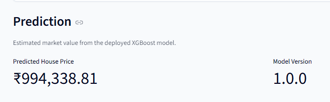
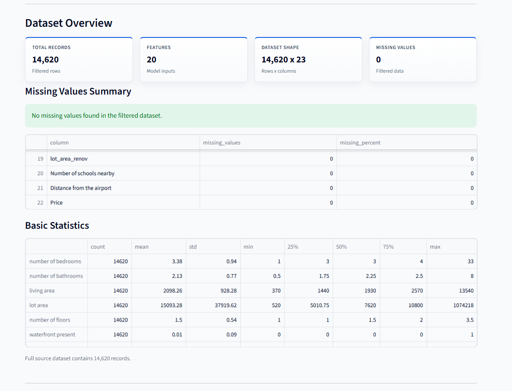
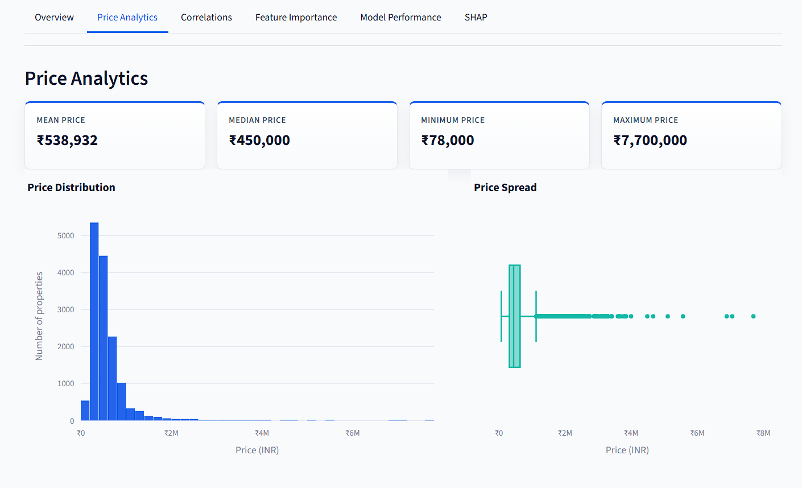
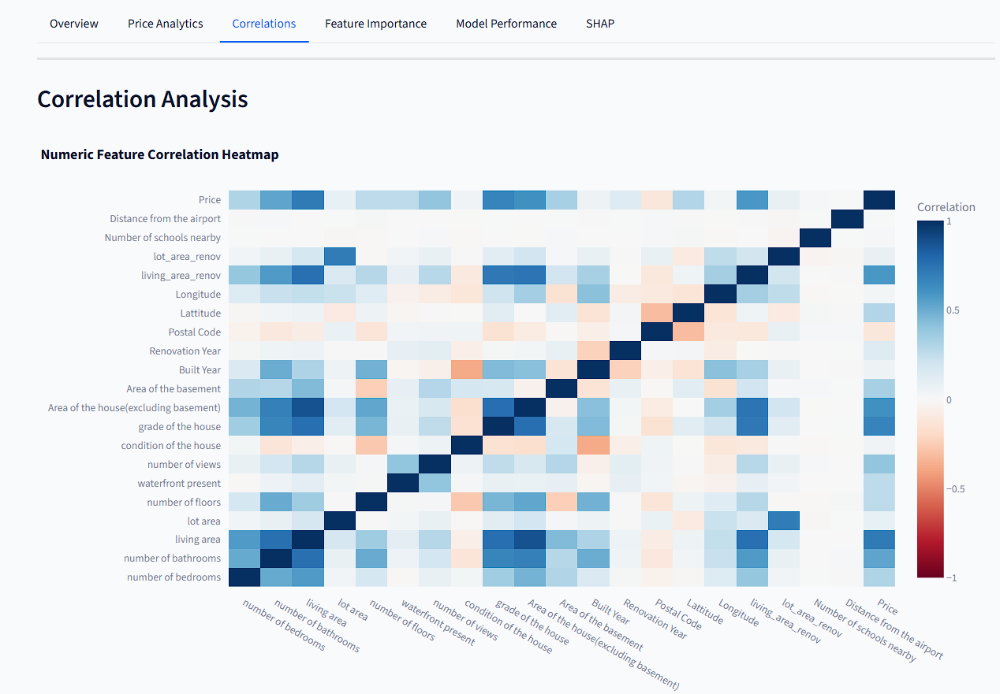
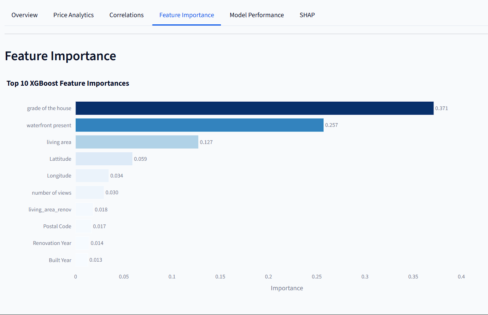
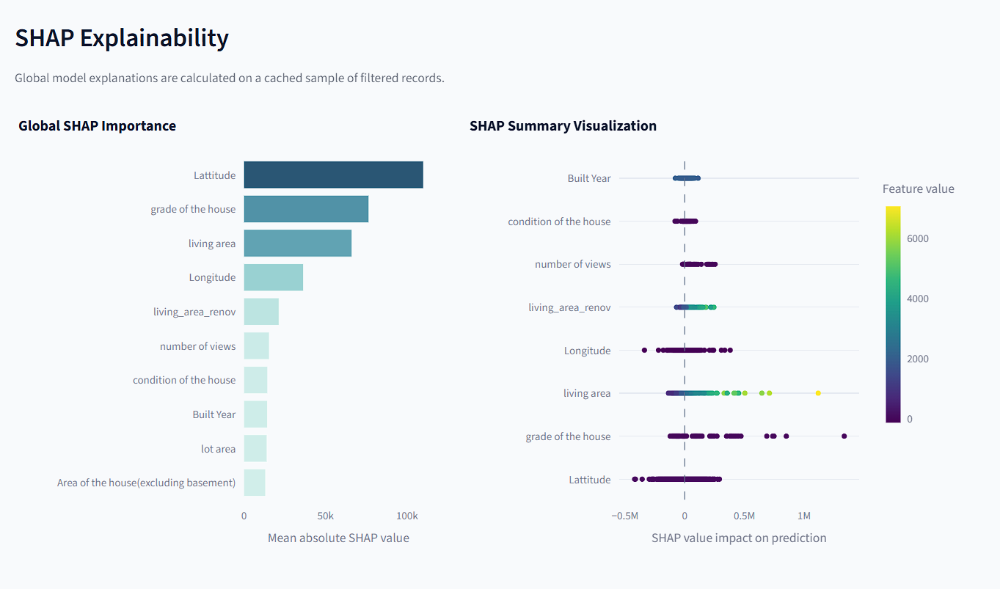
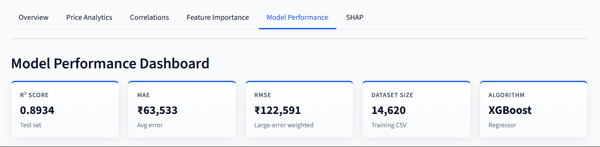

# Housing Intelligence Platform

An end-to-end machine learning platform for housing price prediction,
analytics, and explainable AI.

## Live Demo

🔗 https://housing-intelligence-platform.streamlit.app

## Features

- XGBoost Housing Price Prediction
- FastAPI REST API
- Streamlit Analytics Dashboard
- Correlation Analysis
- Feature Importance Analysis
- SHAP Explainability
- Interactive Data Filtering
- CSV Export
- Model Performance Monitoring

## Model Performance

| Metric | Value |
|----------|----------|
| R² Score | 0.893 |
| MAE | 63,533 |
| RMSE | 122,590 |

Dataset Size: 14,620 records
Algorithm: XGBoost Regressor

# Screenshots

## 1. Prediction Interface


## 2. Analytics Dashboard


## 3. Price Analytics


## 4. Correlation Analysis


## 5. Feature Importance


## 6. SHAP Explainability


## 7. Model Performance


## Project structure

```
housing-intelligence-platform/
├── House Price India.csv   # Default training dataset
├── train.py                # Model training script
├── app.py                  # Inference API
├── requirements.txt
├── artifacts/              # Created after training (model + preprocessors)
└── README.md
```

## Setup

```bash
python -m venv .venv
.venv\Scripts\activate        # Windows
pip install -r requirements.txt
```

## Dataset path

**Change the dataset location in `train.py`:**

```python
DATASET_PATH = Path(__file__).resolve().parent / "House Price India.csv"
```

Replace `"House Price India.csv"` with your CSV filename, or provide an absolute path such as:

```python
DATASET_PATH = Path("C:/data/my_housing_dataset.csv")
```

You can also override the path at runtime without editing the file:

```bash
python train.py --dataset "C:/path/to/your_dataset.csv"
```

The CSV must include a `Price` column as the prediction target.

## Training

```bash
python train.py
```

Optional arguments:

| Flag | Description | Default |
|------|-------------|---------|
| `--dataset` | Path to CSV file | `DATASET_PATH` in `train.py` |
| `--output-dir` | Where to save artifacts | `./artifacts` |
| `--test-size` | Hold-out fraction for evaluation | `0.2` |

Training prints **R2 Score**, **MAE**, and **RMSE** on the test set, then saves:

- `artifacts/housing_model.joblib` — full pipeline (preprocessing + XGBoost)
- `artifacts/preprocessor.joblib` — preprocessing step only
- `artifacts/training_metadata.joblib` — feature names, metrics, and config

## Run the API

```bash
uvicorn app:app --reload
```

Open [http://127.0.0.1:8000/docs](http://127.0.0.1:8000/docs) for interactive API documentation.

### Example prediction

```bash
curl -X POST "http://127.0.0.1:8000/predict" ^
  -H "Content-Type: application/json" ^
  -d "{\"number of bedrooms\": 4, \"number of bathrooms\": 2.5, \"living area\": 2920, \"lot area\": 4000, \"number of floors\": 1.5, \"waterfront present\": 0, \"number of views\": 0, \"condition of the house\": 5, \"grade of the house\": 8, \"Area of the house(excluding basement)\": 1910, \"Area of the basement\": 1010, \"Built Year\": 1909, \"Renovation Year\": 0, \"Postal Code\": 122004, \"Lattitude\": 52.8878, \"Longitude\": -114.47, \"living_area_renov\": 2470, \"lot_area_renov\": 4000, \"Number of schools nearby\": 2, \"Distance from the airport\": 51}"
```

## Model details

- **Algorithm:** XGBoost regressor
- **Preprocessing:** One-hot encoding for categorical columns; numeric columns passed through
- **Split:** 80/20 train-test with fixed random seed for reproducibility
- **Dropped columns:** `id`, `Date` (non-predictive identifiers)
